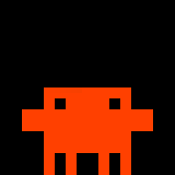
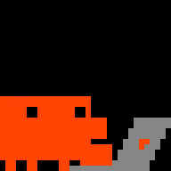

		# Animation Catalogue

Every clip the panel can show, what it is for, and how the mascot gets between them.
**This page is the single source of truth for the art.** If a clip is not here it does not
ship; if it is here, the image below is the exact animation on the panel.

The images are the bundled 32×32 GIFs scaled 6× with nearest-neighbour by
`art/export_docs.py` — every pixel reproduced as a block of pixels, no frame added,
dropped or retimed. The images are the file's own bytes. They are **not** what the panel
shows: it renders this palette warmer, turning the body's `(255,64,0)` into the brand
salmon — see [[Panel Quirks]] → Mixtures for the measured mapping. Regenerate them whenever
the art changes:

```bash
venv/bin/python art/generate.py
venv/bin/python art/export_golden.py
venv/bin/python art/export_docs.py
```

How the clips are *chosen* is [[Menu Bar App]]; how they are *authored* is
[[Art Pipeline]]. This page is the inventory.

## The two kinds of clip

**Loop clips** live *at* a pose and play forever until something swaps them. They carry a
`variantGroup` (the `PanelState` they serve) and a `weight`. Several loops sharing a group
are variants of one another, rotated deterministically.

**Transition clips** play once, carrying the mascot from `fromPose` to `toPose`. They end
on a long dwell frame so the panel has something to hold if the hand-off runs late, which
is why `motion` (the real movement) is much shorter than `duration`.

**The anchor contract binds all of them:** every loop begins and ends on its pose's
pixel-identical anchor frame, and every transition starts and ends on the anchor of the
pose at each end. `idle` frame 0 defines `standing`, `sleeping` frame 0 defines `dozing`,
`working` frame 0 defines `sitting`, and an offscreen anchor is an empty frame. Break this
once and every swap visibly jumps.

**Every clip in the manifest satisfies it.** The last holdout was the flag wave that used
to be `waiting`: it opened and closed mid-gesture, so a swap into it snapped the arm up
four rows and conjured the flag in one frame, and it took a half-raised frame invented at
each end to fix. The question mark that replaced it needs almost no such repair — its
source opens *on* the anchor — see the `waiting` notes below for why hand-drawn art
lands here nearly for free and assembled art has to be argued onto it.

**A turned head must trim its far-side body edge — a constraint on new art, not a rule the
shipped clips satisfy.** Any pose that turns the mascot to face the viewer should shift the
eyes toward the facing side, shade the trailing column to `MASCOT_DARK`, and leave no body
pixel outboard of the far eye, next to the floor line rule below: a turn that leaves
silhouette hanging past the eye reads as the figure widening rather than turning. No shipped
clip turns this way today. `dancing`'s sway turns and violates it — the deep turn presents a
single eye with the full body still behind it, and the shallow turn leaves a stray column past
the far eye — see the known gap below for the frame
numbers and why trimming would make the art worse, not better. The seated fidgets
(`work-coffee`, `work-look`) sidestep the question rather than satisfying it: this mascot is
drawn or imported front-on in every clip, so neither actually turns — see the `sitting` section.

---

## Loops

### standing

**idle** — three variants, the richest set because idle is on screen most.

|                               |                                     |                                     |
| ----------------------------- | ----------------------------------- | ----------------------------------- |
|  |  |  |
| **idle** · 7f · 2.56s · w 1.0 | **dancing** · 18f · 3.71s · w 0.5   | **workout** · 7f · 1.72s · w 0.4    |

**thinking** — two variants, and neither of them mimes thinking.

|                                       |                                               |
| ------------------------------------- | --------------------------------------------- |
|  |  |
| **thinking** · 5f · 3.6s · w 1.0      | **thinking-alt** · 14f · 6.06s · w 0.5        |

**waiting** — one, and it asks the question out loud.

|                                     |
| ----------------------------------- |
|  |
| **waiting** · 17f · 3.22s · w 1.0   |

**done** — two, and they celebrate in opposite idioms.

|                                |                                       |
| ------------------------------ | ------------------------------------- |
|   |  |
| **done** · 17f · 3.29s · w 1.0 | **done-flag** · 59f · 10.16s · w 1.0  |

- `workout` is the barbell press, and it is an **idle** variant. It was the `thinking`
  clip for as long as this project had four animations and four states to spread them
  over, but lifting weights says nothing about working on a prompt — it is the mascot
  doing something while nothing is happening, which is what idle means.
- **The `thinking` group barely performs at all.** `thinking` itself stands and breathes,
  slower than idle does, with one brow up; only `thinking-alt` shows a thought. Thinking
  is mostly not visible from outside, and a mascot that always mimes it has nothing left
  to say when the thought is a hard one.
  Now that a session with a tool call underway sits rather than stands (see
  [[Menu Bar App]]), standing `thinking` is honest for a narrower stretch than before — the
  moment before the first tool call, where nothing has started yet — which is exactly when
  performing nothing is most correct.
- **Three standing variants have been cut, each for a different reason, and none is
  coming back as-is.** `idle-think` was sliced out of the thinking sheet and carried that
  sheet's ~87% silhouette (the same problem `working-alt` had, below), so it read as a
  smaller creature. `idle-alt` was idle's breath at half speed with a one-pixel lean left
  and right underneath it, and the lean was the only thing distinguishing it: a 24px
  figure sliding a pixel sideways on a 32px panel reads as the whole mascot drifting, not
  as it shifting its weight. A fourth idle variant should *do* something — play with a
  ball, say — rather than do idle more slowly. `thinking-pace` walked off one edge and
  back in the other, twice, and it broke the mascot's position: every other clip in its
  group is a standing loop that never leaves the panel, so the choreographer can swap out
  at any frame, while this one spent most of its length offscreen or halfway through a
  doorway. **The pose graph has walks for going places; a loop is the wrong clip to spend
  them in** — see the wander fidgets.
- **The floor line is absolute at `standing`.** Every idle variant keeps all four feet on
  the panel's bottom row; the breath is a torso squash, not a lift of the whole figure.
  `idle` used to bob a pixel upward and read as a slow hop. Only a clip that
  *means* to leave the ground — the jump, the walks — may break it.
- `dancing`, `sleeping`, `waiting` and `done-flag` are imported; everything else above
  is drawn or assembled in `art/generate.py`.
- `thinking-alt` is the long one: an eye lifts, a tail of puffs trails up, a bubble swells
  and fills in a "..." one dot at a time, holds, then retreats the way it came. It was
  sliced out of the 36-frame thinking sheet until that cost it three things at once — the
  sheet's figure is 21×14 against the anchor's 24×16, so the mascot shrank for the length
  of the clip; each tile's own crop differs by a pixel or three, so the silhouette
  juddered side to side; and the whole beat ran in 2.1s, too quick to read as thought.
  Only the last of those is a timing problem, so it was re-authored on the standard
  geometry instead. The body breathes underneath with idle's own torso squash.
- **`thinking` raises the other brow.** One eye up a pixel — the left, mirroring the right
  eye `thinking-alt` opens on — is the only expression this face can carry, and it is the
  whole difference between the clip and `idle` standing still. It is off on the first and
  last frames because those two are the bare `standing` anchor and the anchor contract is
  pixel-identical, brow included.
- **`waiting` is the question mark, and it replaced a flag wave and both its variants.**
  It means Claude is asking *you* for something, so it has two jobs: be seen from across
  a room, and say what it wants once it has been. The flag did only the first — `waiting`
  waved one, `waiting-hop` waved it off the floor line, `waiting-semaphore` waved two in
  counter-phase, and none of the three said "I asked you something". All three are
  retired for one clip that does: a question mark swelling out of the head while an arm
  lifts toward it. **Legibility is still the constraint** — a replacement that whispers
  would be worse than the flag, whatever it depicts.
- **The group is back to one clip, and that costs nothing here.** `idle` and `thinking`
  carry variants because they are on screen for hours and the point of a variant there is
  to stop the panel becoming wallpaper. `waiting` is on screen for a minute at most (the
  longest real wait in the logs was four hours, the median under two minutes), which is
  not long enough to wear out, so a second way of asking buys less than a first way that
  asks clearly.
- **`waiting` bounces, and the bounce keeps the floor line.** The mascot dips into a
  crouch, springs up as the mark swells over its head, holds, and settles. The
  silhouette travels five rows doing it and **all four feet stay welded to row 31 in
  every one of the sixteen frames** — the rise is the torso stretching out of the
  crouch, not the figure leaving the ground. This is the rule above satisfied by art
  that had every excuse to break it, and it is why the clip reads as alive rather than
  as a hop.
- **`waiting` is the first clip to carry a shaded body outside `dancing`.** The source
  shades its raised arm and the underside of the bounce; the shade is thin — eight
  pixels at its peak — but it is what gives the raised arm an edge to be raised *in
  front of*. **The source's own shade value is not shipped**, only the fact that a pixel
  is shaded: it shades (255,109,36) to (200,91,35), a step so light the panel would
  swallow it whole, so the import maps it to `MASCOT_DARK` — the step calibrated against
  photographs. See [[Panel Quirks]].
- **`waiting` satisfies the anchor contract almost for free.** The source's frame 0 *is*
  the `standing` anchor, pixel for pixel, so the leading bookend is a hold rather than a
  repair; only the last frame needs one, being a few pixels of the mark short. The drawn
  flag wave it replaced had to have a half-raised frame invented at each end.
- **`waiting` had never once played before the flag variants were drawn.** Its only
  trigger was the `Notification` hook, which fires zero times in this configuration; `AskUserQuestion`
  is what reaches the state now. The art was fine — it was unreachable. See
  [[Claude Code Plugin]], and do not add art to a state without checking that something
  can still get to it.
- `done` is the *same jump* as the `done-enter` celebration, held as a loop with confetti
  fired on each landing instead of a checkmark. One celebration, told once and then
  sustained — so the hand-off from entrance to loop has nothing to give away. The
  checkmark itself belongs only to `done-enter`; see "The checkmark belongs to `done`"
  under the sit edges below for why it does not also live on the way out of the chair.
- **`done-flag` is the hand-drawn one, and it stays on the floor.** A chequered flag is
  raised overhead and waved six times, all four feet welded to row 31 throughout — where
  `done` leaves the ground twice and throws confetti. Equal weight: neither is the "real"
  celebration, and the two say the same thing loudly and quietly.
- **The flag is authored as a chequerboard**, half white squares and half near-black, and
  that is what makes it survive the shared recolour untouched: the dark squares fail the
  `SHADE_MIN` test and land as background, the white ones clear the chroma test and land
  as a prop. Same hand and same palette as `waiting-question`, so it needed no rule of
  its own.
- **`done-flag`'s six passes live in the source GIF, not in the code.** The file is
  authored intro / cycle / outro — frame 0 *is* the standing anchor, frames 1 and 57 are
  the same crouch bookending the performance, and between them are six passes of one
  9-frame wave. Prolonging it is an edit to `art/sources/done-flag.gif`; `art/generate.py`
  only appends the closing anchor, the last frame being a crouch the loop may not rest
  on. At ten seconds it is by far the longest loop here, deliberately: a flag wave cut
  away from halfway reads as an interruption, where `done`'s jump can be left at any
  landing.

### dozing

|                                       |                                                            |                                                            |
| ------------------------------------- | ---------------------------------------------------------- | ---------------------------------------------------------- |
|  |              |              |
| **sleeping** · 19f · 9.5s · w 1.0     | **stand-to-doze**<br>standing → dozing<br>5f · motion 1.32s | **doze-to-stand**<br>dozing → standing<br>14f · motion 4.06s |

The mascot sleeps **on its feet**: same silhouette as every standing clip, arms slumped
four rows down onto the legs, the face bowed so the eyes read as shut lids at row 24, two
bubbles drifting out of the top-right, and a one-eye peek twice a cycle. Frame 0 and the
last frame are the bare pose with nothing over it — that is the `dozing` anchor.

**All three clips are imported, and that is what makes this pose's edges exact.**
`sleeping` comes from `art/sources/sleeping.gif`, `stand-to-doze` and `doze-to-stand` from
sources of the same names, all three hand-authored on one silhouette — so
`stand-to-doze`'s last frame *is* `sleeping` frame 0 and `doze-to-stand`'s last frame *is*
`idle` frame 0, pixel for pixel, rather than a drawn approximation arriving near them.
Both edges used to be three frames each: the two anchors with one drawn in-between that
dropped the arms and shut the eyes halfway. `stand-to-doze` is now five authored frames of
nodding off, and `doze-to-stand` fourteen — a startle awake with white sparks over the
head, a full stretch with both arms up, then a settle back to standing, which is why it
runs three times as long as the way in. **This is the shape the sit edges still want** and
do not have; see their pop under Known gaps.

The bubbles are drawn over the import rather than authored into it, in `sleeping()`: two
of them drifting up and out of the top-right corner over four 500ms steps, swelling 2 → 3
→ 4 px as they rise the way a real bubble does, half a cycle apart so there are always two
on the panel. `_draw_bubble()` draws the perimeter of a square box minus its four corners,
which is what a circle degenerates to at this scale — a four-pixel diamond at 3, an
eight-pixel ring at 4 — and below that there is no inside to hollow out, so the freshly
blown one is solid.

**This used to be two Zs, and they were replaced at the user's request:** the letter is not
a neutral shape to a Ukrainian reader. Bubbles say "asleep" just as plainly, and the change
is confined to `sleeping()`'s overlay — the imported figure underneath is untouched.

`dozing` is a pose and not just a `standing` clip because the slumped shape is a resting
place the mascot has to be *carried* to.

This pose was `lying` until the art changed. It slept as a 20×6 blob on the floor, which
was legible as a blob and not as this creature — and the reason it stopped sleeping
standing in the first place ("read as the mascot hovering") was the bob bug the idle
variants above no longer have. The node was never the problem; the art was. `sleeping.gif`
is authored at a flat 1000ms a frame — the drawing tool's default, not an intention — so
timing is overridden wholesale in `art/generate.py`: the bubbles are the only thing moving,
so their cadence is the clip's cadence. The two edges are authored at deliberate rates (330ms
and 140ms a frame) and keep their own.

### sitting

|                                      |                                                            |                                                             |
| ------------------------------------ | ----------------------------------------------------------- | ------------------------------------------------------------ |
|  |                 |                  |
| **working** · 25f · 2.24s · w 1.0    | **stand-to-sit**<br>standing → sitting<br>3f · motion 1.4s   | **sit-to-stand**<br>sitting → standing<br>3f · motion 1.4s    |

The sit edges sit inside this loop table rather than in the Transitions section, the same
place `stand-to-doze`/`doze-to-stand` sit inside `dozing` above — a pose's own way in and
out reads better next to the pose than filed separately by clip kind.

`sitting` is where `working` lives, and `working` is on screen for most of a turn — see
[[Menu Bar App]] for why sitting now covers the whole stretch between the first tool call
and the turn ending, rather than flickering in and out between calls. `working` is
`clips.json`'s `variantGroup: "working"` loop at `pose: "sitting"`; the id survives from an
older clip, but the art underneath it does not — the old standing broom sweep is retired,
not rehomed (see below).

**The seated art is imported, not drawn.** `working` comes from `art/sources/work-typing.gif`
— 5 native 32×32 frames at 70ms each, the user's own hand-authored typing loop — and the
pose's anchor, `_sitting_anchor()`, is frame 0 of that same import: the hands-at-rest pose,
not a shape `mascot()` draws. Every other seated clip composites onto copies of this one
frame; nothing calls `mascot()` at the seated pose except the sit edges' single bridging
frame (below).

**This reverses what used to be true here.** `working-alt` (retired, below) and
`idle-think` (cut, see the standing section above) both failed the same way: cropped
per-tile out of a *screenshot* reference sheet at ~87% of the drawn silhouette, with the
crop itself wobbling a pixel or three between tiles, so the figure both shrank and
juddered — and a sheet import has no anchor to speak of, while the sit edges need an exact
pixel target to arrive at and leave from. `work-typing.gif` doesn't share that failure: it
is native 32×32 pixel art authored directly on the panel's own grid, not a screenshot
rescaled down, so there is no shrink to inherit and no per-tile crop to wobble, and frame 0
is a pixel-identical anchor the same way a drawn frame would be. It also already matched
the established geometry (the figure sits at the same rows the drawn seated anchor used),
confines all of its motion to the hands so the head stays perfectly still frame to frame,
and puts his hands on the keyboard — eight columns of silhouette reaching onto the keys
that the drawn version, whose arms could never rise past `MAX_ARM_LIFT` without detaching
from the torso ([[Art Pipeline]]), had no way to show. That last detail is the one the
drawn version could not express at any arm position.

**The import flattens the source's near-black dither to pure background.** The source
tiles an achromatic/warm-tinted checkerboard — `(0,0,0)`/`(1,1,1)`/`(3,3,3)` alternating
with `(10,4,0)`/`(13,5,0)`/`(18,7,0)` — across the whole canvas, not only under the laptop.
[[Panel Quirks]] is explicit that near-black left in empty space genuinely lights those
LEDs, so both tones snap to `BG` on import rather than surviving as a visible grey
checkerboard.

**`laptop()` is deleted.** The desk — lid, deck, hinge — is baked into the imported pixels
now rather than drawn by `mascot()`-style rectangles, and `_desk_sprite()` lifts every
`LAPTOP_GREY` pixel — plus the `PROP` white logo on the lid, which has to travel with the
lid it is painted on — back out of `_sitting_anchor()` into its own sprite, so the sit edges
can still slide it in and out independent of the figure — the same job `laptop()` used to
do. The colour is unchanged, `(134, 134, 134)`, the same mid-tone [[Panel Quirks]]
documents the panel rendering as blue-violet, now snapped onto the source's own laptop
pixels by `_typing_recolour()` instead of filled by a drawn rectangle.

**The seated figure carries two body tones, and the lid's logo is white.** Both are the
source's own authoring, and both were lost by the first `_typing_recolour()`: it split on
max channel alone, which flattened the secondary colour on the back and the turned-away arm
into one `MASCOT` slab and painted the white logo orange. The split is by chroma now, and
the secondary tone maps to `MASCOT_DARK` — `dancing()`'s deep tone, chosen for legibility on
the panel over faithfulness to the source's much subtler step. See [[Art Pipeline]] for the
cutoffs.

**Five fidgets are scoped to `sitting`**, each a non-looping self-edge with
`fidgetGroup: "working"` so none of them can fire anywhere else — the same scoping the
wander fidgets use for `idle`, below. `work-look-down` belongs here, not with the
`working` loop above: in `clips.json` it carries `fidgetGroup: "working"` with
`fromPose`/`toPose` both `sitting`, the identical shape as the other four fidgets, not the
`variantGroup`/`pose` shape `working` itself has.

|                                         |                                             |                                         |                                           |                                                   |
| --------------------------------------- | ------------------------------------------- | --------------------------------------- | ----------------------------------------- | ------------------------------------------------- |
|  |  |  |  |  |
| **work-idea**<br>sitting, 7f · 1.31s    | **work-coffee**<br>sitting, 43f · 10.32s      | **work-look**<br>sitting, 15f · 1.35s   | **work-think**<br>sitting, 13f · 4.88s    | **work-look-down**<br>sitting, 15f · 1.35s        |

`work-idea` lifts an eye, sparks, and runs a fast typing burst — the same imported frames
`working` plays, just stepped through at a faster cadence. `work-coffee` brings a cup up,
sips it a few times and sets it down — hand-drawn art, imported rather than composited, so
its shape and its timing are both the source's. It is the longest seated beat by some way,
because the sip repeats. The source is authored as a ping-pong (its own return leg is in
the file) and its first frame recolours to `_sitting_anchor()` exactly, so only the closing
dwell is appended. `work-look` lifts both eyes to look up from the screen while the
hands keep typing, then lets them back down. `work-look-down` is its mirror, imported
rather than drawn: the same beat with the eyes authored a row lower in the second source
file instead of raised in code. `work-think`
is the desk-side thought bubble the seated pose needed, `_thought_bubble()`'s own geometry
recentred and composited over a copy of the imported anchor rather than drawn straight into
a frame — thinking at the desk is a beat on top of `working`, not a state of its own.

**Neither `work-coffee` nor `work-look` turns the mascot to face the viewer.** This mascot
is drawn — and, for the seated pose, imported — front-on in every clip, so there is no
away-facing pose to turn from — the turned-head rule above does not apply to either. The
attention shift in both is the way `thinking-alt` draws its own eye lift, applied to the
imported art instead of a `mascot()` draw: paint over and redraw with the eyes higher (or,
for `work-look-down`, imported already lower) in the head. `work-look` lifts both eyes,
symmetric, to keep it visually distinct from the single-eye quizzical lift `work-idea` and
`thinking-alt` use.

**Two edges connect `sitting` to `standing`**: `stand-to-sit` (he lowers himself, the desk
comes in) and `sit-to-stand` (the desk recedes, he stands), both pixel-exact on the anchor
at each end, closing what was previously the one pose with no way in or out. Both bridge
through one drawn frame, `_sit_mid()` — the single place `mascot()` still draws a
seated-ish pose, because it is the only frame that has to connect a *drawn* standing
figure to the *imported* seated one, and nothing imported exists partway between those two
poses. What that bridge costs is the new known gap below.

**The checkmark belongs to `done`, not to `sit-to-stand`.** `sit-to-stand` fires on every
departure from the desk — including into `waiting` and into a panel shutdown — so a
checkmark on that edge would celebrate departures that completed nothing, exactly the
false-completion problem the `done` debounce ([[Menu Bar App]]) exists to remove. The
route to a genuine `done` instead plays `sit-to-stand` (close the lid, get up) and then
`done-enter` (the checkmark, the jump): the checkmark still lands immediately after he
stands, and only when the turn actually finished.

**`working-alt` is retired.** The sprite sheet it was cut from stays in `art/sources` as
reference art, the way the thinking sheet already does after `thinking-alt` was
re-authored off it — a record of where the art came from, not a clip that ships.

**The broom sweep is retired outright.** It was `working` in name only: `pose: sitting` on
a figure that stands the whole time it sweeps, drawn on the mascot's own loading-animation
silhouette rather than the current figure. An earlier pass rehomed it to `standing` as an
idle variant named `sweeping`, on the same reasoning that moved `workout` off `thinking` —
but the user's verdict on the result was blunt: *"it has the old posture"*. Rehoming did not
fix that; only retiring it does. `art/sources/claude-claude-code-1.gif` stays in `art/sources`
as reference art, unused by any clip.

### offBottom

|                             |
| --------------------------- |
|  |
| **off** · 1f · 1.0s · w 1.0 |

Never uploaded. `PanelController` cuts power for `.off` instead. It exists only so every
`PanelState` resolves to *something*, keeping the state↔asset mapping total.

---

## Transitions

### Pose edges

|                                                            |                                                       |
| ---------------------------------------------------------- | ----------------------------------------------------- |
|                       |                          |
| **starting**<br>offBottom → standing<br>16f · motion 2.52s | **sink**<br>standing → offBottom<br>5f · motion 0.56s |

|                                                              |                                                            |                                                                |                                                              |
| ------------------------------------------------------------ | ---------------------------------------------------------- | -------------------------------------------------------------- | ------------------------------------------------------------ |
|               |               |               |               |
| **walk-off-left**<br>standing → offLeft<br>5f · motion 0.56s | **walk-in-left**<br>offLeft → standing<br>5f · motion 0.7s | **walk-off-right**<br>standing → offRight<br>5f · motion 0.56s | **walk-in-right**<br>offRight → standing<br>5f · motion 0.7s |

`starting` is the original hand-drawn entrance and is far longer than the others (2.5s of
motion against ~0.6s); it is the one transition the user is meant to notice.

**These six edges are also the mascot's comings and goings, not just routes between
poses.** `PanelState.away` picks `walk-off-left` or `walk-off-right` per epoch to leave by
before the panel goes dark, and the arrival takes whichever entrance matches where it
went — `starting` from `offBottom`, `walk-in-left`/`walk-in-right` from the sides. `sink`
is deliberately not an exit: sinking through the floor is the entrance played backwards
and reads as the mascot being swallowed rather than choosing to go. It keeps its place
inside the wander fidgets, where the mascot comes back.

**`art/sources/appear.gif` is not one animation but three**, and `art/generate.py` now
cuts it into three clips rather than playing the whole 32-frame strip once a session:

| Coalesced frames | Becomes | Why |
|---|---|---|
| 0–14 | `starting` | Bursting up through the floor only makes sense as an entrance. |
| 3–14 | `done` / `done-enter` | A clean crouch → leap → land. It reads as a jump anywhere, not just on arrival. |
| 15–31 | `dancing` | A shaded sway that never leaves the floor — an idle that was stranded at the tail of a clip that plays once. |

The split falls at **15**, where the shading starts: frames 15–17 carry 46 shaded pixels
each against 0 in every frame before them, and they are the mascot *turning*. Anywhere
but in the sway they read as extra beats after the motion has already finished, so
neither the entrance nor the jump takes them.

Cutting the jump there left the celebrations' props running past the end of the clip —
the second confetti burst had one frame to live on and the checkmark two. Both now append
three plain standing frames (`DONE_SETTLE`) for the props to finish over: the mascot has
landed and is still, and the confetti keeps rising out of the top of the panel.

The frame numbers are indices into the **coalesced** strip — PIL merges runs of identical
frames when it encodes the GIF, so the raw import is numbered differently. `coalesce()` in
`art/generate.py` is what makes the numbers here, in the code and in the shipped GIF the
same numbers.

### Self-edges — fidgets and one-shots

| | | |
|---|---|---|
|  |  |  |
| **fidget-stretch**<br>standing, 7f · 0.77s | **fidget-look**<br>standing, 5f · 0.78s | **done-enter**<br>standing, 15f · motion 2.45s |

|                                   |
| --------------------------------- |
|  |
| **wave-off**<br>standing → standing, non-looping, `fidgetGroup: "away"` |

`wave-off` fires on system sleep to wave goodbye before walking off. It declares `fidgetGroup: "away"` to keep `Choreographer.selectFidget` from drawing it as a random idle beat. The art is currently `dancing`'s frames pending a hand-drawn replacement.

#### The wander fidgets

|                                                                       |                                                                       |                                                       |
| --------------------------------------------------------------------- | --------------------------------------------------------------------- | ----------------------------------------------------- |
|  |  |  |
| **wander-off-left-in-right**<br>9f · motion 3.9s                      | **wander-off-right-in-left**<br>9f · motion 3.9s                      | **wander-sink-rise**<br>21f · motion 5.72s            |

Nine clips, every pairing of an exit (`sink`, `walk-off-left`, `walk-off-right`) with an
entrance (`walk-in-left`, `walk-in-right`, `starting`) — the mascot steps out and comes
back. Three are shown; the ids are `wander-<sink|off-left|off-right>-<in-left|in-right|rise>`.

Each is literally its two halves played end to end. That works because the exits already
close on an empty panel with a long dwell and the entrances open on one, so **the join is
the beat spent offscreen** — no extra frame authors it. It also means each pair inherits
the anchor contract from its halves: the exit opens on the standing anchor, the entrance
closes on it, which is exactly the self-edge shape a fidget must be.

The sides are deliberately mixed rather than paired. Walking off left and strolling back
in from the right is the joke; sinking through the floor and rising out of it again is the
other one. Nothing is on screen in between to contradict either.

**These are the one kind of fidget that is scoped to a state.** Fidget selection is by
*pose*, so an untagged standing fidget fires in every standing state — fine for a stretch,
wrong for walking off the panel while `waiting` is asking the user for something. So each
wander carries `fidgetGroup: "idle"`, and `Choreographer.selectFidget` keeps a tagged
fidget to its own group. `fidgetGroup` is deliberately its own field rather than a reuse
of `variantGroup`: both would read as "which group is this in", but one says which pool a
*loop* rotates within and the other which state a *one-shot* may fire for, and a single
field answering both could only be read by first checking `loops`. At weight 0.2 each they total 1.8 against `fidget-stretch` and
`fidget-look`'s 2.0, so a fidget is still slightly more likely to be a small one than a
whole trip offscreen. The five `sitting` fidgets in the loops section above follow the
same shape, scoped by `fidgetGroup: "working"` instead.

Fidgets are motion with no cause — the thing that separates "animated" from "alive". They
fire on a seeded roll during long holds and return the mascot exactly where it stood.

`done-enter` is the `<group>-enter` one-shot: it plays once on arriving at `done`, then
the `done` loop takes over. Both are the jump cut out of `appear.gif` (frames 3–17 above);
the checkmark is what makes this one the beat you notice, and the confetti is what carries
the loop after it. Both props wait for the landing — at the apex the mascot spans rows
1–22 and there is no clear panel left to draw on. **The naming is load-bearing** — a clip is treated as an
entrance only if its id is `<group>-enter`, and as a fidget only if it is a non-looping
self-edge that is *not* an entrance. Declare one wrong and it silently never fires.

---

## The pose graph

```
        offLeft ──walk-in-left──►  standing  ◄──walk-in-right── offRight
              ◄──walk-off-left──   ▲ │ ▲ │ ▲ │         ──walk-off-right──►
                                   │ │ │ │ │ │
              starting ────────────┘ │ │ │ │ └──────────── doze-to-stand
            (from offBottom)         │ │ │ │                  (from dozing)
                                     │ │ │ │
                            sink ────┘ │ │ └────► stand-to-doze
                       (to offBottom)  │ │              (to dozing)
                                       │ │
                    sit-to-stand ──────┘ └──────► stand-to-sit
                     (from sitting)                  (to sitting)
```

| From ↓ To → | standing | sitting | dozing | offLeft | offRight | offBottom |
|---|---|---|---|---|---|---|
| **standing** | — | `stand-to-sit` | `stand-to-doze` | `walk-off-left` | `walk-off-right` | `sink` |
| **sitting** | `sit-to-stand` | — | ❌ | ❌ | ❌ | ❌ |
| **dozing** | `doze-to-stand` | ❌ | — | ❌ | ❌ | ❌ |
| **offLeft** | `walk-in-left` | ❌ | ❌ | — | ❌ | ❌ |
| **offRight** | `walk-in-right` | ❌ | ❌ | ❌ | — | ❌ |
| **offBottom** | `starting` | ❌ | ❌ | ❌ | ❌ | — |

`standing` is the hub: every route runs through it, and the choreographer's breadth-first
search finds multi-hop paths for free (`dozing → offLeft` walks `doze-to-stand` then
`walk-off-left`, one edge per boundary). `sitting` now hangs off the hub the same way
`dozing` does — one edge in, one edge out, both through `standing`.

A ❌ is not a bug. Where no path exists the choreographer swaps directly at the next
boundary — the panel's swaps are seamless, so a missing edge costs a pose pop, never a
stall.

## Known gaps — the work worth doing next

1. ~~**`waiting` has no variants**~~ — **closed, then deliberately reopened and dropped.**
   `waiting-hop` and `waiting-semaphore` joined the wave, and the state became reachable
   at last; then all three were retired for the single question-mark clip, because saying
   the right thing once beats saying the wrong thing three ways. `waiting` is back to one
   clip on purpose and this is not a gap — see the `standing` section above.
2. **No fidgets at `dozing`.** `fidget-doze` was drawn against the retired floor blob and
   went with it, so a doze fidget is a clean slot to fill.
3. ~~The second Z is a 2×2 dot~~ — **closed, and then moot.** `sleeping` drew two Zs at
   sizes 3 and 2; at size 2 the diagonal stroke had zero height, so the smaller one
   degenerated into a square. There are no Zs any more — see the bubbles in the `dozing`
   section — and `_draw_bubble()` is legible at every size it is used at.
4. **`dancing` violates the turned-head rule, and a trim makes it worse, not better.** On
   the deep turns — `dancing`'s coalesced frames 6 and 15 — the shading (43 pixels against
   46–47 on the shallow turns) shows a single eye with the full 16-wide torso still behind
   it; "no body outboard of the far eye" there would mean trimming eight of sixteen columns,
   halving the head rather than turning it. On the shallow turns the rule cannot be applied
   either: in `dancing` frame 1 the eyes sit at x13–14 and x21–22 with exactly one body
   column at x23, and erasing that column opens the far eye into the background — it stops
   reading as an eye and becomes a notch in the outline — while narrowing the head from 16
   columns to 13 across most of the sway, the same shrinking silhouette this page already
   records as the reason `idle-think` was cut and `working-alt` was retired. This was
   investigated and a trim was attempted and reverted for exactly that reason. The honest fix
   is re-authoring the sway's turned frames so the eyes shift and the head narrows together,
   keeping the silhouette one width throughout — not a repair pass on the existing frames —
   and that is a separate task.
5. ~~`work-idea`'s spark sits ~6 rows above the seated head with nothing bridging the gap~~ —
   **closed.** The imported seated head tops out at row 18, two rows lower than the retired
   drawn one, and `work_idea()` places the spark at row 17 — one clear row above the head —
   which closes most of the old gap for free and the rest by deliberate placement.
6. ~~`work-coffee`'s mug occupies the far arm's position rather than being held at the end
   of it, so "holding" is implied by adjacency rather than drawn~~ — **closed**, and then
   superseded: the clip is hand-drawn art now, so the cup and the hands are whatever the
   source says they are rather than a composite this file builds. The intermediate drawn
   version — a 5x5 body with a see-through C-shaped handle, plus three "keyboard finger"
   pixels it cleared before those turned out to be the lid's logo — is gone with it.
7. **The sit edges pop.** Measured, not guessed: `_standing_anchor()` and
   `_sitting_anchor()` differ by **293 pixels** — a structural gap between a drawn
   rectangle figure and an imported photographic-silhouette one, not just a difference in
   pose — and the three-frame `stand-to-sit`/`sit-to-stand` transition leaves a worst
   frame-to-frame delta of **166 px**, against **21–42 px** for the worst frame of each of
   the five seated beats. A grid search over `_sit_mid()`'s own parameters (`by`, `dx`,
   leg fold, arm position, desk slide offset) could not bring the worse of the transition's
   two hops below ~157–160px. This is a structural consequence of a drawn standing figure
   meeting imported seated art, not a tuning miss: closing it means either more frames to
   spread the movement across, or redrawing one end of the bridge to match the other's own
   geometry — not a parameter tweak to the existing three-frame register.
