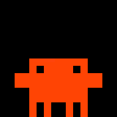
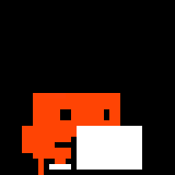
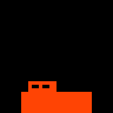

# Animation Catalogue

Every clip the panel can show, what it is for, and how the mascot gets between them.
**This page is the single source of truth for the art.** If a clip is not here it does not
ship; if it is here, the image below is the exact animation on the panel.

The images are the bundled 32×32 GIFs scaled 6× with nearest-neighbour by
`art/export_docs.py` — every pixel reproduced as a block of pixels, no frame added,
dropped or retimed. Regenerate them whenever the art changes:

```bash
venv/bin/python art/generate.py
venv/bin/python art/export_golden.py
venv/bin/python art/export_docs.py
```

How the clips are *chosen* is [[Menu Bar App]]; how they are *authored* is
[[Art Pipeline]]. This page is the inventory.

## The two kinds of clip

**Loop clips** live *at* a pose and play forever until something swaps them. They carry a
`variantGroup` (the `PanelState` they serve) and a `weight`. Several loops sharing a group
are variants of one another, rotated deterministically.

**Transition clips** play once, carrying the mascot from `fromPose` to `toPose`. They end
on a long dwell frame so the panel has something to hold if the hand-off runs late, which
is why `motion` (the real movement) is much shorter than `duration`.

**The anchor contract binds all of them:** every loop begins and ends on its pose's
pixel-identical anchor frame, and every transition starts and ends on the anchor of the
pose at each end. `idle` frame 0 defines `standing`; `sleeping` frame 0 defines `lying`;
an offscreen anchor is an empty frame. Break this once and every swap visibly jumps.

---

## Loops

### standing

| | | | |
|---|---|---|---|
|  |  |  |  |
| **idle** · 7f · 2.56s · w 1.0 | **idle-alt** · 9f · 4.56s · w 0.4 | **idle-think** · 7f · 1.48s · w 0.3 | **thinking** · 5f · 1.12s · w 1.0 |

| | | |
|---|---|---|
|  |  |  |
| **thinking-alt** · 15f · 2.1s · w 0.5 | **waiting** · 8f · 1.12s · w 1.0 | **done** · 8f · 1.2s · w 1.0 |

- `idle` group has three variants — the richest set, because idle is on screen most.
- `thinking-alt` is imported from a hand-drawn sheet; the rest of this row is drawn in
  `art/generate.py`.
- `waiting` is the flag wave: it means Claude is asking *you* for something, so it should
  stay the most legible clip on the panel from across a room.
- `done` is the *satisfied* loop that follows the `done-enter` celebration, not the
  celebration itself.

### sitting

| | |
|---|---|
|  |  |
| **working** · 36f · 3.65s · w 1.0 | **working-alt** · 36f · 5.31s · w 0.5 |

`working` is the broom sweep; `working-alt` is the imported laptop sheet. **Nothing
connects to `sitting`** — see the gaps below — so both are only ever reached by a direct
swap.

### lying

| |
|---|
|  |
| **sleeping** · 8f · 4.8s · w 1.0 |

Frame 0 defines the `lying` anchor. It used to be drawn standing with its eyes shut, which
read as the mascot hovering; it now rests on the panel floor and breathes as a width pulse.

### offBottom

|                             |
| --------------------------- |
|  |
| **off** · 1f · 1.0s · w 1.0 |

Never uploaded. `PanelController` cuts power for `.off` instead. It exists only so every
`PanelState` resolves to *something*, keeping the state↔asset mapping total.

---

## Transitions

### Pose edges

|                                                           |                                                       |                                                          |                                                          |
| --------------------------------------------------------- | ----------------------------------------------------- | -------------------------------------------------------- | -------------------------------------------------------- |
|                      |                          |             |             |
| **starting**<br>offBottom → standing<br>32f · motion 5.6s | **sink**<br>standing → offBottom<br>5f · motion 0.56s | **stand-to-lie**<br>standing → lying<br>6f · motion 0.7s | **lie-to-stand**<br>lying → standing<br>6f · motion 0.7s |

| | | | |
|---|---|---|---|
|  |  |  |  |
| **walk-off-left**<br>standing → offLeft<br>5f · motion 0.56s | **walk-in-left**<br>offLeft → standing<br>5f · motion 0.7s | **walk-off-right**<br>standing → offRight<br>5f · motion 0.56s | **walk-in-right**<br>offRight → standing<br>5f · motion 0.7s |

`starting` is the original hand-drawn entrance and is far longer than the others (5.6s of
motion against ~0.6s); it is the one transition the user is meant to notice.

### Self-edges — fidgets and one-shots

| | | | |
|---|---|---|---|
|  |  |  |  |
| **fidget-stretch**<br>standing, 7f · 0.77s | **fidget-look**<br>standing, 5f · 0.78s | **fidget-doze**<br>lying, 5f · 1.3s | **done-enter**<br>standing, 7f · 0.78s |

Fidgets are motion with no cause — the thing that separates "animated" from "alive". They
fire on a seeded roll during long holds and return the mascot exactly where it stood.

`done-enter` is the `<group>-enter` one-shot: it plays once on arriving at `done`, then
the `done` loop takes over. **The naming is load-bearing** — a clip is treated as an
entrance only if its id is `<group>-enter`, and as a fidget only if it is a non-looping
self-edge that is *not* an entrance. Declare one wrong and it silently never fires.

---

## The pose graph

```
        offLeft ──walk-in-left──►  standing  ◄──walk-in-right── offRight
              ◄──walk-off-left──   ▲ │ ▲               ──walk-off-right──►
                                   │ │ │
              starting ────────────┘ │ └──────────── lie-to-stand
            (from offBottom)         │                  (from lying)
                                     │
                            sink ────┘────► offBottom
                    stand-to-lie ────────► lying

                              sitting   ← no edges at all
```

| From ↓ To → | standing | sitting | lying | offLeft | offRight | offBottom |
|---|---|---|---|---|---|---|
| **standing** | — | ❌ | `stand-to-lie` | `walk-off-left` | `walk-off-right` | `sink` |
| **sitting** | ❌ | — | ❌ | ❌ | ❌ | ❌ |
| **lying** | `lie-to-stand` | ❌ | — | ❌ | ❌ | ❌ |
| **offLeft** | `walk-in-left` | ❌ | ❌ | — | ❌ | ❌ |
| **offRight** | `walk-in-right` | ❌ | ❌ | ❌ | — | ❌ |
| **offBottom** | `starting` | ❌ | ❌ | ❌ | ❌ | — |

`standing` is the hub: every route runs through it, and the choreographer's breadth-first
search finds multi-hop paths for free (`lying → offLeft` walks `lie-to-stand` then
`walk-off-left`, one edge per boundary).

A ❌ is not a bug. Where no path exists the choreographer swaps directly at the next
boundary — the panel's swaps are seamless, so a missing edge costs a pose pop, never a
stall.

## Known gaps — the work worth doing next

1. **`sitting` is an island.** `stand-to-sit` and `sit-to-stand` would be the single
   biggest improvement here: `working` is one of the most-shown states, and today the
   mascot teleports into and out of it. They were deliberately deferred because the
   sitting art was being replaced in the same run and a transition drawn against art that
   is about to change is wasted work.
2. **The imported sheets are ~87% the scale of the drawn art** (21×14 against 24×16 at
   rest). `thinking-alt`, `idle-think` and `working-alt` satisfy the anchor contract by
   being bookended with the drawn anchor frame, so they are *correct* — but there is a
   visible size pop at each end. Rescaling the sheet art to the drawn silhouette is the
   real fix.
3. **The laptop in `working-alt` is a featureless white slab.** The panel renders any
   colour whose brightest channel is under 255 as blue-violet (see [[Panel Quirks]]), so
   its grey had to become pure white and the screen detail flattened out. Black outlines
   would give it shape back within the palette.
4. **`waiting` has no variants**, despite being the state that most wants to catch your
   eye.
5. **No fidgets at `sitting`** — the mascot is perfectly still at the laptop between loops.
