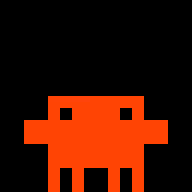
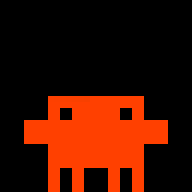
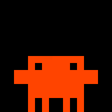
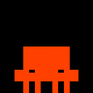
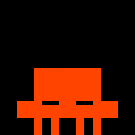
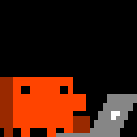
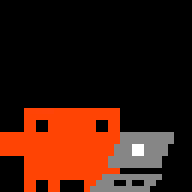
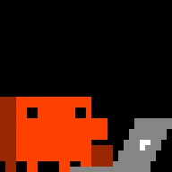
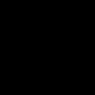
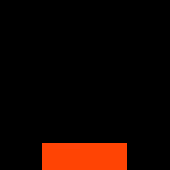

# Animation Catalogue

Every clip the panel can show, what it is for, and how the mascot gets between them.
**This page is the single source of truth for the art.** If a clip is not here it does not
ship; if it is here, the image below is the exact animation on the panel.

The images are the bundled 32×32 GIFs scaled 6× with nearest-neighbour by
`art/export_docs.py` — every pixel reproduced as a block of pixels, no frame added,
dropped or retimed. Regenerate them whenever the art changes:

```bash
venv/bin/python art/generate.py
venv/bin/python art/export_golden.py
venv/bin/python art/export_docs.py
```

How the clips are *chosen* is [[Menu Bar App]]; how they are *authored* is
[[Art Pipeline]]. This page is the inventory.

## The two kinds of clip

**Loop clips** live *at* a pose and play forever until something swaps them. They carry a
`variantGroup` (the `PanelState` they serve) and a `weight`. Several loops sharing a group
are variants of one another, rotated deterministically.

**Transition clips** play once, carrying the mascot from `fromPose` to `toPose`. They end
on a long dwell frame so the panel has something to hold if the hand-off runs late, which
is why `motion` (the real movement) is much shorter than `duration`.

**The anchor contract binds all of them:** every loop begins and ends on its pose's
pixel-identical anchor frame, and every transition starts and ends on the anchor of the
pose at each end. `idle` frame 0 defines `standing`, `sleeping` frame 0 defines `dozing`,
and an offscreen anchor is an empty frame. Break this once and every swap visibly jumps.

**Every clip in the manifest now satisfies it.** `waiting` was the last holdout: its wave
opened and closed mid-gesture, so a swap into it snapped the arm up four rows and conjured
the flag in one frame. It gains one half-raised frame at each end — the arm halfway, the
flag just clearing the head — which is all the contract needs.

**A turned head must trim its far-side body edge — a constraint on new art, not a rule the
shipped clips satisfy.** Any pose that turns the mascot to face the viewer should shift the
eyes toward the facing side, shade the trailing column to `MASCOT_SHADE`, and leave no body
pixel outboard of the far eye, next to the floor line rule below: a turn that leaves
silhouette hanging past the eye reads as the figure widening rather than turning. No shipped
clip turns this way today. `dancing`'s sway and the `sweeping` broom both turn and both
violate it — the deep turns present a single eye with the full body still behind it, and the
shallow ones leave a stray column past the far eye — see the known gap below for the frame
numbers and why trimming would make the art worse, not better. The seated fidgets
(`work-coffee`, `work-look`) sidestep the question rather than satisfying it: this mascot is
drawn front-on in every clip, so neither actually turns — see the `sitting` section.

---

## Loops

### standing

**idle** — five variants, the richest set because idle is on screen most.

| | | | | |
|---|---|---|---|---|
|  |  |  |  |  |
| **idle** · 7f · 2.56s · w 1.0 | **idle-alt** · 9f · 4.56s · w 0.4 | **dancing** · 18f · 3.71s · w 0.5 | **workout** · 7f · 1.72s · w 0.4 | **sweeping** · 36f · 4.09s · w 0.4 |

**thinking** — three variants, and none of them mimes thinking.

| | | |
|---|---|---|
|  |  |  |
| **thinking** · 3f · 3.6s · w 1.0 | **thinking-alt** · 14f · 6.06s · w 0.5 | **thinking-pace** · 17f · 4.72s · w 0.5 |

**waiting** and **done** — one each.

|                                     |                                |
| ----------------------------------- | ------------------------------ |
|  |   |
| **waiting** · 12f · 1.86s · w 1.0 | **done** · 17f · 3.29s · w 1.0 |

- `workout` is the barbell press, and it is an **idle** variant. It was the `thinking`
  clip for as long as this project had four animations and four states to spread them
  over, but lifting weights says nothing about working on a prompt — it is the mascot
  doing something while nothing is happening, which is what idle means.
- **`sweeping` joins `workout` as an idle variant, by the same reasoning** — see the
  `sitting` section below for what it used to be and why it moved.
- **The `thinking` group performs nothing.** `thinking` itself just stands and breathes,
  slower than idle does; `thinking-pace` walks off one side and back in the other, twice,
  which on a panel with no middle distance is what walking in circles looks like; only
  `thinking-alt` shows a thought at all. Thinking is mostly not visible from outside, and
  a mascot that always mimes it has nothing left to say when the thought is a hard one.
  Now that a session with a tool call underway sits rather than stands (see
  [[Menu Bar App]]), standing `thinking` is honest for a narrower stretch than before — the
  moment before the first tool call, where nothing has started yet — which is exactly when
  performing nothing is most correct.
- A fourth idle variant, `idle-think`, was cut: sliced out of the thinking sheet, it
  carried that sheet's ~87% silhouette (the same problem `working-alt` had, below) and
  read as a smaller creature.
- **The floor line is absolute at `standing`.** Every idle variant keeps all four feet on
  the panel's bottom row; the breath is a torso squash, not a lift of the whole figure.
  `idle`/`idle-alt` used to bob a pixel upward and read as a slow hop. Only a clip that
  *means* to leave the ground — the jump, the walks — may break it.
- `dancing` and `sleeping` are imported; everything else above is drawn or assembled in
  `art/generate.py`.
- `thinking-alt` is the long one: an eye lifts, a tail of puffs trails up, a bubble swells
  and fills in a "..." one dot at a time, holds, then retreats the way it came. It was
  sliced out of the 36-frame thinking sheet until that cost it three things at once — the
  sheet's figure is 21×14 against the anchor's 24×16, so the mascot shrank for the length
  of the clip; each tile's own crop differs by a pixel or three, so the silhouette
  juddered side to side; and the whole beat ran in 2.1s, too quick to read as thought.
  Only the last of those is a timing problem, so it was re-authored on the standard
  geometry instead. The body breathes underneath with idle's own torso squash.
- `waiting` is the flag wave: it means Claude is asking *you* for something, so it should
  stay the most legible clip on the panel from across a room.
- `done` is the *same jump* as the `done-enter` celebration, held as a loop with confetti
  fired on each landing instead of a checkmark. One celebration, told once and then
  sustained — so the hand-off from entrance to loop has nothing to give away. The
  checkmark itself belongs only to `done-enter`; see "The checkmark belongs to `done`"
  under the sit edges below for why it does not also live on the way out of the chair.

### dozing

| | | |
|---|---|---|
|  |  |  |
| **sleeping** · 19f · 9.5s · w 1.0 | **stand-to-doze**<br>standing → dozing<br>3f · motion 1.4s | **doze-to-stand**<br>dozing → standing<br>3f · motion 1.4s |

The mascot sleeps **on its feet**: same silhouette as every standing clip, arms slumped
four rows down onto the legs, the face bowed so the eyes read as shut lids at row 24, two
Zs drifting out of the top-right, and a one-eye peek twice a cycle. Frame 0 and the last
frame are the bare pose with no Zs — that is the `dozing` anchor.

`dozing` is a pose and not just a `standing` clip because the slumped shape is a resting
place the mascot has to be *carried* to. `stand-to-doze` is the three slow frames that do
it: the anchor, one drawn in-between with the hands and eyes half down, then the sleeping
pose. `doze-to-stand` is the same three in reverse.

This pose was `lying` until the art changed. It slept as a 20×6 blob on the floor, which
was legible as a blob and not as this creature — and the reason it stopped sleeping
standing in the first place ("read as the mascot hovering") was the bob bug the idle
variants above no longer have. The node was never the problem; the art was. Its source,
`art/sources/sleep.gif`, is authored at a flat 1000ms a frame, so timing is overridden
wholesale in `art/generate.py`: the Zs are the only thing moving, so their cadence is the
clip's cadence.

### sitting

|                                      |                                                          |                                                        |
| ------------------------------------ | -------------------------------------------------------- | ------------------------------------------------------ |
|  |              |            |
| **working** · 9f · 2.9s · w 1.0     | **stand-to-sit**<br>standing → sitting<br>3f · motion 1.4s | **sit-to-stand**<br>sitting → standing<br>3f · motion 1.4s |

The sit edges sit inside this loop table rather than in the Transitions section, the same
place `stand-to-doze`/`doze-to-stand` sit inside `dozing` above — a pose's own way in and
out reads better next to the pose than filed separately by clip kind.

`sitting` is where `working` lives, and `working` is on screen for most of a turn — see
[[Menu Bar App]] for why sitting now covers the whole stretch between the first tool call
and the turn ending, rather than flickering in and out between calls. The pose has a drawn
anchor (`_sitting_anchor()`, alongside `_standing_anchor()` and `_dozing_anchor()`); the
`working` loop is drawn against it as a seated pose, replacing the old standing broom
sweep — the id survives, the art underneath it does not (the sweep is rehomed rather than
discarded; see below). `sitting` also has four fidget beats scoped to it, and the two edges
that carry the mascot to and from `standing`.

**The seated art is drawn on the standard geometry, not sliced from a sheet.** The retired
seated clip, `working-alt`, was imported from a reference sprite sheet at ~87% of the drawn
silhouette with a per-tile crop that wobbled a pixel or three — the same failure mode
`idle-think` was cut for. A sheet import also has no anchor to speak of: the sit edges need
an exact pixel target to arrive at and leave from, which only drawn art gives.

**The laptop is drawn in three-quarter view, flat grey, at the reference art's own
value.** Chunk 8 replaced the earlier outlined near-black lid with the reference's true
`(134,134,134)` — a flat fill, no outline — at the user's explicit direction: that value
is the exact mid-tone [[Panel Quirks]] documents the panel rendering as blue-violet, and
it ships anyway as the deliberate next test of that rule (see Panel Quirks' own note on
the single photo that now complicates it). The silhouette carries the whole read: a
lid (`LAPTOP_LID`) that leans away from the viewer, stepping a column right with each
row as it rises, and a keyboard deck (`LAPTOP_DECK`) that comes toward the viewer,
stepping a column left with each row as it descends, with a one-row gap left as
background between them — the hinge seam a solid slab would not have. A 2×2 white logo
sits on the lid back, and two small background notches in the deck's middle row read as
keys. It is drawn lid-back to the viewer, in front of the figure, and drawn last so it
occludes the figure's lower right side and near arm — the same trick that lets a 24px
figure and the laptop both fit inside 32 columns, and (since chunk 8) what puts his hands
at the keyboard: `_sitting_anchor()` now draws both arms and lets the lid cover the near
one, rather than hiding it outright.

**Four fidgets are scoped to `sitting`**, each a non-looping self-edge with
`fidgetGroup: "working"` so none of them can fire anywhere else — the same scoping the
wander fidgets use for `idle`, below.

|                                          |                                            |                                        |                                          |
| ----------------------------------------- | -------------------------------------------- | ---------------------------------------- | -------------------------------------------- |
|    |   |   |     |
| **work-idea**<br>sitting, 9f · 1.4s        | **work-coffee**<br>sitting, 8f · 1.88s        | **work-look**<br>sitting, 6f · 1.81s      | **work-think**<br>sitting, 14f · 4.88s        |

`work-idea` lifts an eye, sparks, and runs a fast typing burst. `work-coffee` brings a
cup up in front of him, held in both hands for a sip, then sets it back down and lets it
go — chunk 8 moved it from a small mug at his side to this bigger, two-handed hold in
front of the torso, at the user's direction; it stays clear of the eyes at every frame.
`work-look` holds a beat and blinks. `work-think`
is the desk-side thought bubble the seated pose needed, built by reusing
`_thought_bubble()` rather than adding a new `PanelState` — thinking at the desk is a beat
on top of `working`, not a state of its own.

**Neither `work-coffee` nor `work-look` turns the mascot to face the viewer.** This mascot
is drawn front-on in every clip, so there is no away-facing pose to turn from — the
turned-head rule above does not apply to either. The attention shift in both is drawn the
way `thinking-alt` draws its own eye lift: paint over and redraw with the eyes higher in
the head. `work-look` lifts both eyes, symmetric, to keep it visually distinct from the
single-eye quizzical lift `work-idea` and `thinking-alt` use.

**Two edges connect `sitting` to `standing`**: `stand-to-sit` (he lowers himself, the lid
comes in) and `sit-to-stand` (the lid closes and leaves, he stands), both pixel-exact on
the anchor at each end, closing what was previously the one pose with no way in or out.

**The checkmark belongs to `done`, not to `sit-to-stand`.** `sit-to-stand` fires on every
departure from the desk — including into `waiting` and into a panel shutdown — so a
checkmark on that edge would celebrate departures that completed nothing, exactly the
false-completion problem the `done` debounce ([[Menu Bar App]]) exists to remove. The
route to a genuine `done` instead plays `sit-to-stand` (close the lid, get up) and then
`done-enter` (the checkmark, the jump): the checkmark still lands immediately after he
stands, and only when the turn actually finished.

**`working-alt` is retired.** The sprite sheet it was cut from stays in `art/sources` as
reference art, the way the thinking sheet already does after `thinking-alt` was
re-authored off it — a record of where the art came from, not a clip that ships.

**The broom sweep moves to `standing`, renamed `sweeping`, and joins `idle`.** It was
`working` in name only: `pose: sitting` on a figure that stands the whole time it sweeps.
Once `working` means the drawn seated loop, the sweep has nowhere honest left to be, and
`idle` is exactly where it belongs — the same move `workout` made, by the same reasoning:
sweeping the floor says nothing about working on a prompt, it is the mascot doing
something while nothing is happening. Its worst frames are dropped going in.

### offBottom

|                             |
| --------------------------- |
|  |
| **off** · 1f · 1.0s · w 1.0 |

Never uploaded. `PanelController` cuts power for `.off` instead. It exists only so every
`PanelState` resolves to *something*, keeping the state↔asset mapping total.

---

## Transitions

### Pose edges

|                                                            |                                                       |
| ---------------------------------------------------------- | ----------------------------------------------------- |
|                       |                          |
| **starting**<br>offBottom → standing<br>16f · motion 2.52s | **sink**<br>standing → offBottom<br>5f · motion 0.56s |

|                                                              |                                                            |                                                                |                                                              |
| ------------------------------------------------------------ | ---------------------------------------------------------- | -------------------------------------------------------------- | ------------------------------------------------------------ |
|               |               |               |               |
| **walk-off-left**<br>standing → offLeft<br>5f · motion 0.56s | **walk-in-left**<br>offLeft → standing<br>5f · motion 0.7s | **walk-off-right**<br>standing → offRight<br>5f · motion 0.56s | **walk-in-right**<br>offRight → standing<br>5f · motion 0.7s |

`starting` is the original hand-drawn entrance and is far longer than the others (2.5s of
motion against ~0.6s); it is the one transition the user is meant to notice.

**These six edges are also the mascot's comings and goings, not just routes between
poses.** `PanelState.away` picks `walk-off-left` or `walk-off-right` per epoch to leave by
before the panel goes dark, and the arrival takes whichever entrance matches where it
went — `starting` from `offBottom`, `walk-in-left`/`walk-in-right` from the sides. `sink`
is deliberately not an exit: sinking through the floor is the entrance played backwards
and reads as the mascot being swallowed rather than choosing to go. It keeps its place
inside the wander fidgets, where the mascot comes back.

**`art/sources/appear.gif` is not one animation but three**, and `art/generate.py` now
cuts it into three clips rather than playing the whole 32-frame strip once a session:

| Coalesced frames | Becomes | Why |
|---|---|---|
| 0–14 | `starting` | Bursting up through the floor only makes sense as an entrance. |
| 3–14 | `done` / `done-enter` | A clean crouch → leap → land. It reads as a jump anywhere, not just on arrival. |
| 15–31 | `dancing` | A shaded sway that never leaves the floor — an idle that was stranded at the tail of a clip that plays once. |

The split falls at **15**, where the shading starts: frames 15–17 carry 46 shaded pixels
each against 0 in every frame before them, and they are the mascot *turning*. Anywhere
but in the sway they read as extra beats after the motion has already finished, so
neither the entrance nor the jump takes them.

Cutting the jump there left the celebrations' props running past the end of the clip —
the second confetti burst had one frame to live on and the checkmark two. Both now append
three plain standing frames (`DONE_SETTLE`) for the props to finish over: the mascot has
landed and is still, and the confetti keeps rising out of the top of the panel.

The frame numbers are indices into the **coalesced** strip — PIL merges runs of identical
frames when it encodes the GIF, so the raw import is numbered differently. `coalesce()` in
`art/generate.py` is what makes the numbers here, in the code and in the shipped GIF the
same numbers.

### Self-edges — fidgets and one-shots

| | | |
|---|---|---|
|  |  |  |
| **fidget-stretch**<br>standing, 7f · 0.77s | **fidget-look**<br>standing, 5f · 0.78s | **done-enter**<br>standing, 15f · motion 2.45s |

#### The wander fidgets

|                                                                     |                                                                       |                                                                 |
| ------------------------------------------------------------------- | --------------------------------------------------------------------- | --------------------------------------------------------------- |
|  |  |            |
| **wander-off-left-in-right**<br>9f · motion 3.9s                      | **wander-off-right-in-left**<br>9f · motion 3.9s                      | **wander-sink-rise**<br>21f · motion 5.72s                      |

Nine clips, every pairing of an exit (`sink`, `walk-off-left`, `walk-off-right`) with an
entrance (`walk-in-left`, `walk-in-right`, `starting`) — the mascot steps out and comes
back. Three are shown; the ids are `wander-<sink|off-left|off-right>-<in-left|in-right|rise>`.

Each is literally its two halves played end to end. That works because the exits already
close on an empty panel with a long dwell and the entrances open on one, so **the join is
the beat spent offscreen** — no extra frame authors it. It also means each pair inherits
the anchor contract from its halves: the exit opens on the standing anchor, the entrance
closes on it, which is exactly the self-edge shape a fidget must be.

The sides are deliberately mixed rather than paired. Walking off left and strolling back
in from the right is the joke; sinking through the floor and rising out of it again is the
other one. Nothing is on screen in between to contradict either.

**These are the one kind of fidget that is scoped to a state.** Fidget selection is by
*pose*, so an untagged standing fidget fires in every standing state — fine for a stretch,
wrong for walking off the panel while `waiting` is asking the user for something. So each
wander carries `fidgetGroup: "idle"`, and `Choreographer.selectFidget` keeps a tagged
fidget to its own group. `fidgetGroup` is deliberately its own field rather than a reuse
of `variantGroup`: both would read as "which group is this in", but one says which pool a
*loop* rotates within and the other which state a *one-shot* may fire for, and a single
field answering both could only be read by first checking `loops`. At weight 0.2 each they total 1.8 against `fidget-stretch` and
`fidget-look`'s 2.0, so a fidget is still slightly more likely to be a small one than a
whole trip offscreen. The four `sitting` fidgets in the loops section above follow the
same shape, scoped by `fidgetGroup: "working"` instead.

Fidgets are motion with no cause — the thing that separates "animated" from "alive". They
fire on a seeded roll during long holds and return the mascot exactly where it stood.

`done-enter` is the `<group>-enter` one-shot: it plays once on arriving at `done`, then
the `done` loop takes over. Both are the jump cut out of `appear.gif` (frames 3–17 above);
the checkmark is what makes this one the beat you notice, and the confetti is what carries
the loop after it. Both props wait for the landing — at the apex the mascot spans rows
1–22 and there is no clear panel left to draw on. **The naming is load-bearing** — a clip is treated as an
entrance only if its id is `<group>-enter`, and as a fidget only if it is a non-looping
self-edge that is *not* an entrance. Declare one wrong and it silently never fires.

---

## The pose graph

```
        offLeft ──walk-in-left──►  standing  ◄──walk-in-right── offRight
              ◄──walk-off-left──   ▲ │ ▲ │ ▲ │         ──walk-off-right──►
                                   │ │ │ │ │ │
              starting ────────────┘ │ │ │ │ └──────────── doze-to-stand
            (from offBottom)         │ │ │ │                  (from dozing)
                                     │ │ │ │
                            sink ────┘ │ │ └────► stand-to-doze
                       (to offBottom)  │ │              (to dozing)
                                       │ │
                    sit-to-stand ──────┘ └──────► stand-to-sit
                     (from sitting)                  (to sitting)
```

| From ↓ To → | standing | sitting | dozing | offLeft | offRight | offBottom |
|---|---|---|---|---|---|---|
| **standing** | — | `stand-to-sit` | `stand-to-doze` | `walk-off-left` | `walk-off-right` | `sink` |
| **sitting** | `sit-to-stand` | — | ❌ | ❌ | ❌ | ❌ |
| **dozing** | `doze-to-stand` | ❌ | — | ❌ | ❌ | ❌ |
| **offLeft** | `walk-in-left` | ❌ | ❌ | — | ❌ | ❌ |
| **offRight** | `walk-in-right` | ❌ | ❌ | ❌ | — | ❌ |
| **offBottom** | `starting` | ❌ | ❌ | ❌ | ❌ | — |

`standing` is the hub: every route runs through it, and the choreographer's breadth-first
search finds multi-hop paths for free (`dozing → offLeft` walks `doze-to-stand` then
`walk-off-left`, one edge per boundary). `sitting` now hangs off the hub the same way
`dozing` does — one edge in, one edge out, both through `standing`.

A ❌ is not a bug. Where no path exists the choreographer swaps directly at the next
boundary — the panel's swaps are seamless, so a missing edge costs a pose pop, never a
stall.

## Known gaps — the work worth doing next

1. **`waiting` has no variants**, despite being the state that most wants to catch your
   eye.
2. **No fidgets at `dozing`.** `fidget-doze` was drawn against the retired floor blob and
   went with it, so a doze fidget is a clean slot to fill.
3. **The second Z is a 2×2 dot.** `sleeping` draws two Zs at sizes 3 and 2; at size 2 the
   diagonal stroke has zero height, so the smaller one degenerates into a square. It has
   always been that way — it reads as distance rather than as a letter, which is
   survivable, but a 2-wide Z drawn deliberately would be better than one that collapses.
4. **`dancing` and the sweep both violate the turned-head rule, and a trim makes it worse,
   not better.** On the deep turns — `dancing`'s coalesced frames 6 and 15, and the sweep's
   own coalesced frames 12 and 21 — the shading (43 pixels against 46–47 on the shallow
   turns) shows a single eye with the full 16-wide torso still behind it; "no body outboard
   of the far eye" there would mean trimming eight of sixteen columns, halving the head
   rather than turning it. On the shallow turns the rule cannot be applied either: in
   `dancing` frame 1 the eyes sit at x13–14 and x21–22 with exactly one body column at x23,
   and erasing that column opens the far eye into the background — it stops reading as an
   eye and becomes a notch in the outline — while narrowing the head from 16 columns to 13
   across most of the sway, the same shrinking silhouette this page already records as the
   reason `idle-think` was cut and `working-alt` was retired. This was investigated and a
   trim was attempted and reverted for exactly that reason. The honest fix is re-authoring
   the sway's turned frames so the eyes shift and the head narrows together, keeping the
   silhouette one width throughout — not a repair pass on the existing frames — and that is
   a separate task.
5. **`work-idea`'s spark sits ~6 rows above the seated head with nothing bridging the
   gap**, where `thinking-alt`'s bubble has a puff tail; it may read as floating rather than
   as his.
6. **`work-coffee`'s mug occupies the far arm's position rather than being held at the end
   of it**, so "holding" is implied by adjacency rather than drawn.
